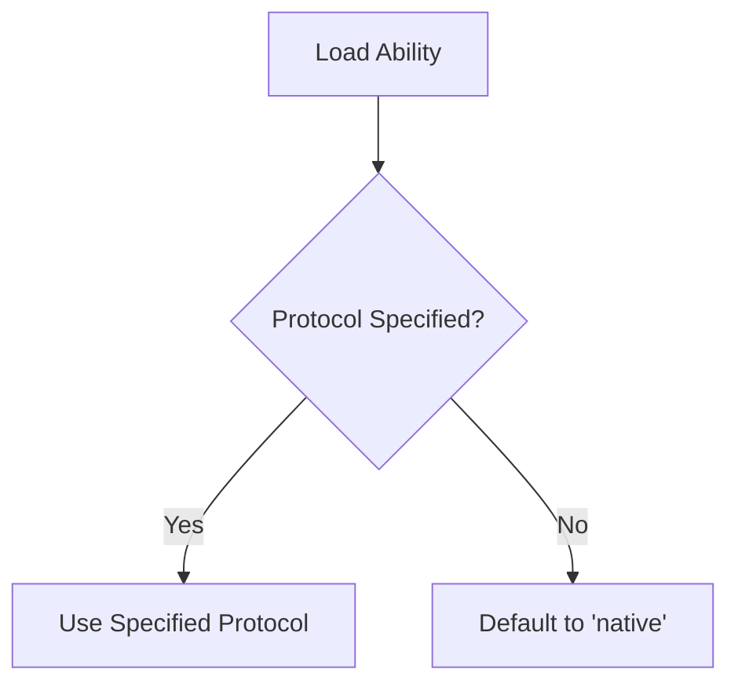
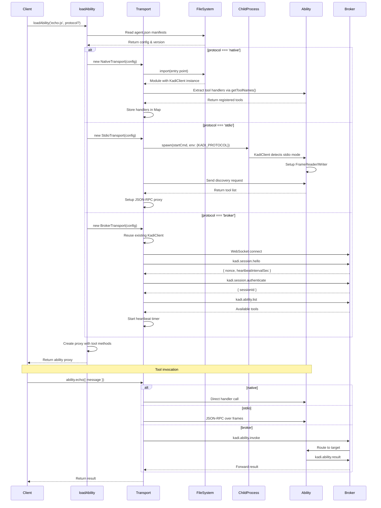
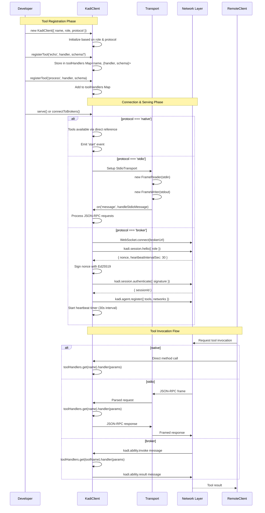
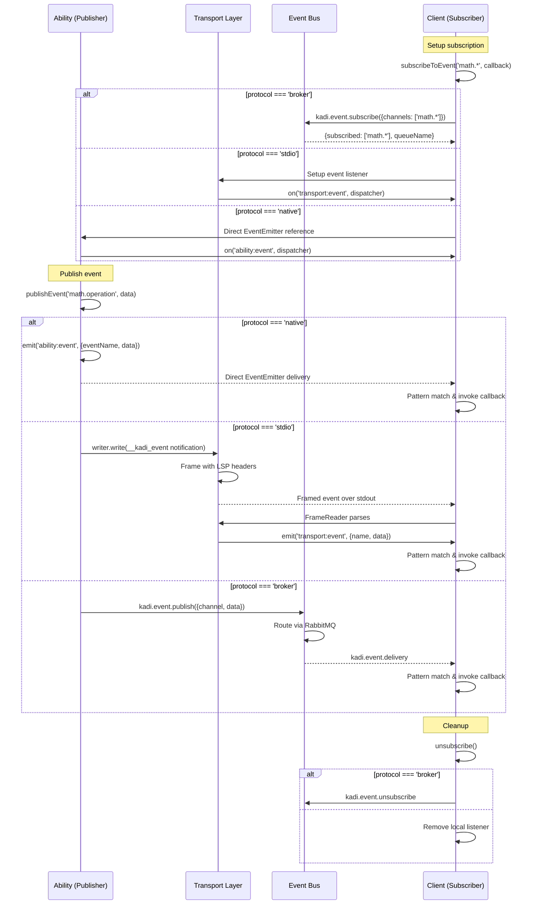
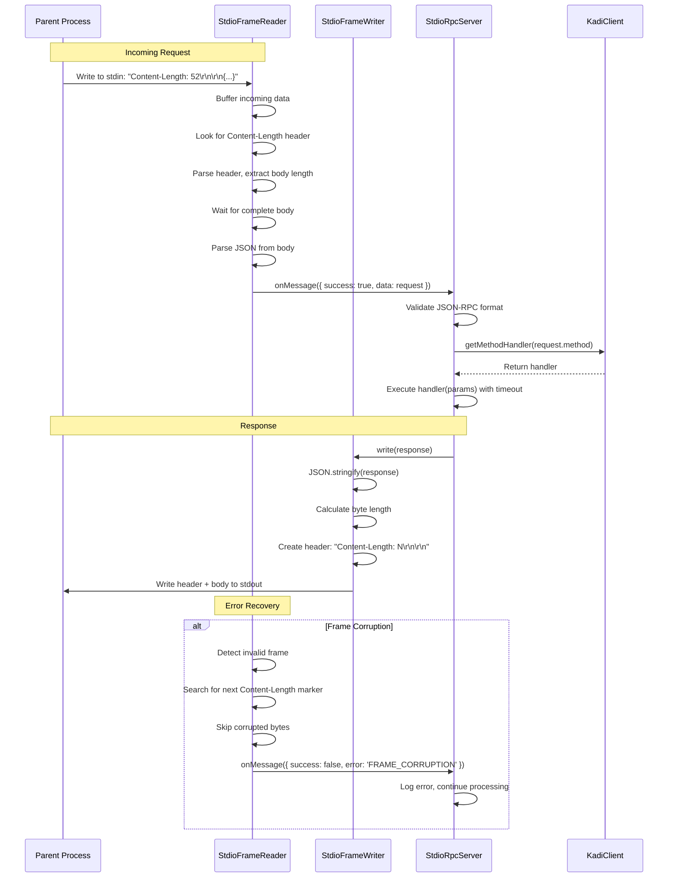

# @kadi.build/core

> A comprehensive toolkit for building and managing KADI abilities with multiple transport protocols

[](https://www.npmjs.com/package/@kadi.build/core)
[](https://opensource.org/licenses/MIT)

## 🎯 Overview

`@kadi.build/core` is the foundational library for creating KADI abilities - modular, protocol-agnostic components that can communicate via multiple transport layers. Whether you're building local tools, distributed systems, or high-performance native modules, this toolkit provides a unified, developer-friendly API that abstracts away transport complexity.

## 📚 Table of Contents

- [🎯 Overview](#-overview)
- [📦 Installation](#-installation)
- [🚀 Quick Start](#-quick-start)
- [🔌 Transport Protocols](#-transport-protocols)
- [🛠️ Creating Abilities](#-creating-abilities)
- [🤖 Creating Agents](#-creating-agents)
- [🔄 Architecture Deep Dive](#-architecture-deep-dive)
- [📥 Loading Abilities](#-loading-abilities)
- [⚙️ Configuration](#-configuration)
- [🚀 Advanced Usage](#-advanced-usage)
- [🔧 Development Workflow](#-development-workflow)
- [📖 API Reference](#-api-reference)
- [🎮 Running the Examples](#-running-the-examples)
- [💡 Additional Examples](#-additional-examples)
- [🐛 Troubleshooting](#-troubleshooting)
- [🤝 Contributing](#-contributing)
- [📄 License](#-license)
- [🔗 Related Projects](#-related-projects)
- [📚 Resources](#-resources)

## 📦 Installation

```bash
npm install @kadi.build/core
```

For global CLI tools:

```bash
npm install -g @kadi.build/cli
```

## 🚀 Quick Start

The library provides a unified way to work with KADI through the **KadiClient** class, which can operate in multiple roles:

- **As an Ability**: Serving tools/methods that others can call
- **As an Agent**: Calling remote tools via broker protocol

### Creating Your First Ability

```javascript
#!/usr/bin/env node
import { KadiClient } from '@kadi.build/core';

// Create a ability instance
const mathAbility = new KadiClient({
  name: 'math-ability',
  role: 'ability', // 'agent', 'ability'
  protocol: 'stdio' // 'native', 'stdio', or 'broker'
});

// Register a tool
mathAbility.registerTool('add', async ({ a, b }) => {
  return { result: a + b };
});

// Start serving requests
mathAbility.serve().catch(console.error);
```

### Loading and Using Abilities

```javascript
import { loadAbility } from '@kadi.build/core';

async function main() {
  // Load an ability (uses first interface defined in agent.json)
  const math = await loadAbility('math-ability');

  // Call methods like regular functions
  const result = await math.add({ a: 5, b: 3 });
  console.log(result); // { result: 8 }
}

main().catch(console.error);
```

### Creating a Broker-Connected Agent

```javascript
import { KadiClient } from '@kadi.build/core';

// Create an agent that connects to broker
const agent = new KadiClient({
  name: 'my-agent',
  role: 'agent',
  protocol: 'broker',
  brokers: {
    prod: 'ws://localhost:8080',
    dev: 'ws://localhost:8081'
  },
  defaultBroker: 'prod',
  networks: ['global']
});

// Register tools that other agents can call
agent.registerTool(
  'greet',
  async ({ name }) => {
    return { greeting: `Hello, ${name}!` };
  },
  {
    description: 'Greet someone by name',
    inputSchema: {
      type: 'object',
      properties: {
        name: { type: 'string', description: 'Name to greet' }
      },
      required: ['name']
    }
  }
);

// Connect to brokers and start serving
await agent.connectToBrokers();

// Call tools from OTHER agents connected to the same broker
const result = await agent.callTool('translate', 'text-tool', {
  text: 'Hello world',
  language: 'spanish'
});
console.log(result);
```

## 🔌 Transport Protocols

KADI abilities support three transport protocols, each optimized for different use cases:

### 1. Native Protocol (Fastest)

- **Use Case**: High-performance, in-process execution
- **How it Works**: Loads abilities as ES modules, enabling direct function calls
- **Performance**: Zero IPC overhead - functions run in the same process
- **Best For**: Utility libraries, data processing, performance-critical operations

```javascript
// Loads as native module by default if available
const ability = await loadAbility('my-ability', 'native');
```

### 2. Stdio Protocol (Balanced)

- **Use Case**: Language-agnostic local execution
- **How it Works**: Spawns abilities as child processes, communicates via LSP-style JSON-RPC over stdin/stdout
- **Performance**: Minimal overhead, reliable local IPC
- **Best For**: Python scripts, Go binaries, Node.js abilities, development/testing

```javascript
// Force stdio protocol
const ability = await loadAbility('my-ability', 'stdio');
```

**Environment Variables Passed to Child Process:**

```bash
KADI_PROTOCOL=stdio  # Identifies the protocol being used
# Plus all parent process.env variables
```

### 3. Broker Protocol (Distributed)

- **Use Case**: Distributed systems, containerized deployments
- **How it Works**: Abilities connect to a WebSocket broker for network communication
- **Performance**: Network overhead, but enables scaling and distribution
- **Best For**: Distributed abilities, cloud deployments, load-balanced systems

```javascript
// Use broker for distributed execution
const ability = await loadAbility('my-ability', 'broker');
```

**Environment Variables Passed to Child Process:**

```bash
KADI_PROTOCOL=broker                       # Identifies the protocol
KADI_BROKER_URL=ws://localhost:8080        # Broker connection URL
KADI_ABILITY_NAME=ability.echo.1_0_0       # Ability identifier
KADI_AGENT_SCOPE=uuid-here                 # Agent's scope/namespace
# Plus all parent process.env variables
```

**Network/Namespace Visibility:**

The `KADI_AGENT_SCOPE` environment variable represents the agent's namespace. For the ability to be visible to its parent agent via the broker, it must register with the same network:

```javascript
// In your ability code:
const echoAbility = new KadiClient({
  name: 'echo-js',
  version: '0.0.1',
  description: 'Echo ability with broker support',
  network: process.env.KADI_AGENT_SCOPE // Use agent's network for visibility
});

// Without this, the ability would only be visible in the 'global' network
// and the parent agent wouldn't be able to communicate with it
```

### Protocol Selection Strategy

When no protocol is specified, `loadAbility` defaults to the 'native' protocol. You must explicitly specify the protocol if you want to use 'stdio' or 'broker'.



## 🛠️ Creating Abilities with KadiClient

### Basic Ability Structure

```javascript
import { KadiClient } from '@kadi.build/core';

const ability = new KadiClient({
  name: 'echo-ability',
  role: 'ability', // 'agent', 'ability',
  protocol: 'stdio', // 'native', 'stdio', or 'broker'
  brokers: {
    local: 'ws://localhost:8080',
    prod: 'ws://api.example.com:8080'
  },
  defaultBroker: 'local'
});

// Method 1: Simple tool registration
ability.registerTool('echo', async ({ message }) => ({
  echo: message,
  timestamp: new Date().toISOString()
}));

// Method 2: Tool with inline schema
ability.registerTool(
  'format',
  async ({ text, style }) => ({
    formatted: style === 'upper' ? text.toUpperCase() : text.toLowerCase()
  }),
  {
    description: 'Format text with specified style',
    inputSchema: {
      type: 'object',
      properties: {
        text: { type: 'string', description: 'Text to format' },
        style: {
          type: 'string',
          enum: ['upper', 'lower'],
          description: 'Formatting style'
        }
      },
      required: ['text', 'style']
    },
    outputSchema: {
      type: 'object',
      properties: {
        formatted: { type: 'string', description: 'Formatted text' }
      }
    }
  }
);

// Start serving
ability.serve().catch(console.error);
```

### Event Publishing and Subscription

**Full Support**: Events work across all protocols - native, stdio, and broker.

KadiClient provides a unified event system that works consistently across all transport protocols:

```javascript
// In your ability (ability.js)
const ability = new KadiClient({
  name: 'my-ability',
  role: 'ability',
  protocol: 'broker' // Works with all protocols
});

// Publish events from tool handlers
ability.registerTool('echo', async ({ message }) => {
  // Publish events during processing
  await ability.publishEvent('echo.processing', { status: 'started' });

  // Do work...
  const result = { echo: message, timestamp: new Date().toISOString() };

  await ability.publishEvent('echo.completed', { result });
  return result;
});

// In your agent (agent.js)
const agent = new KadiClient({
  name: 'my-client',
  role: 'agent',
  protocol: 'broker'
});

// Subscribe to events using patterns
agent.subscribeToEvent('echo.*', (data) => {
  console.log('Echo event received:', data);
});

// For loaded abilities with native/stdio protocols
const ability = await loadAbility('my-ability', 'stdio');
ability.events.on('echo.completed', (data) => {
  console.log('Completed:', data);
});
```

**Event Patterns**:

- Use wildcards: `math.*` matches `math.operation`, `math.milestone`
- Protocol-specific delivery:
  - **Native**: Direct EventEmitter (synchronous)
  - **Stdio**: JSON-RPC notifications over stdout
  - **Broker**: RabbitMQ pub/sub via WebSocket

### Ability Configuration (agent.json)

Every ability should have an `agent.json` file that defines its capabilities:

```json
{
  "name": "echo-ability",
  "kind": "ability",
  "version": "1.0.0",
  "license": "MIT",
  "description": "Echo ability with multiple transport support",
  "scripts": {
    "setup": "npm install",
    "start": "node ability.js"
  },
  "exports": [
    {
      "name": "echo",
      "description": "Echo the input message",
      "inputSchema": {
        "type": "object",
        "properties": {
          "message": { "type": "string" }
        },
        "required": ["message"]
      },
      "outputSchema": {
        "type": "object",
        "properties": {
          "echo": { "type": "string" },
          "timestamp": { "type": "string" }
        }
      }
    }
  ],
  "brokers": {
    "local": "ws://localhost:8080",
    "remote": "ws://api.example.com:8080"
  },
  "defaultBroker": "local"
}
```

### Schema Definition Options

The ability system provides two ways to define method schemas:

1. **Export Schemas** (defined in `agent.json` exports section)
2. **Inline Schemas** (passed directly to `registerTool()`)

```javascript
// Option 1: Define in agent.json exports section
// The schema is picked up automatically if the method name matches
// agent.json:
{
  "exports": [
    {
      "name": "process",
      "description": "Process data",
      "inputSchema": { /* ... */ },
      "outputSchema": { /* ... */ }
    }
  ]
}

// Option 2: Define inline when registering the method
ability.registerTool('process', handler, {
  description: 'Process data',
  inputSchema: { /* ... */ },
  outputSchema: { /* ... */ }
});

// Note: If both are defined, inline schemas take precedence over exports
```

**Important**: Specifying MCP schemas for ability handlers is particularly important for `broker` communication. If you only need `native` and `stdio` protocols, schemas can be omitted.

## 🤖 Working with KadiClient

KadiClient is the unified API for all KADI operations. It replaces the previous separate KadiAbility and KadiAgent classes with a single, powerful interface that can operate in multiple roles.

### Direct Approach (using loadAbility)

```javascript
import { loadAbility } from '@kadi.build/core';

// Load and call abilities directly
const echoAbility = await loadAbility('echo-js', 'stdio');
const result = await echoAbility.echo({ message: 'Hello world' });

// Load broker tools directly
const remoteAbility = await loadAbility('remote-ability', 'broker', {
  brokerUrl: 'ws://localhost:8080',
  networks: ['global']
});
const brokerResult = await remoteAbility.process({ data: 'test' });
```

### Using KadiClient with Named Brokers

```javascript
import { KadiClient } from '@kadi.build/core';

// Create a unified client with named brokers
const client = new KadiClient({
  name: 'my-ability',
  role: 'ability', // Provider role
  protocol: 'broker',
  brokers: {
    dev: 'ws://localhost:8080',
    staging: 'ws://staging.example.com:8080',
    prod: 'ws://prod.example.com:8080'
  },
  defaultBroker: 'dev',
  networks: ['global']
});

// Register tools for others to call
client.registerTool(
  'greet',
  async ({ name }) => {
    return { greeting: `Hello, ${name}!` };
  },
  {
    description: 'Greet someone by name',
    inputSchema: {
      type: 'object',
      properties: { name: { type: 'string' } },
      required: ['name']
    }
  }
);

// Connect to all configured brokers
await client.connectToBrokers();

// Call remote tools
const result = await client.callTool('translator', 'translate', {
  text: 'Hello',
  to: 'es'
});

// Load abilities for compatibility
const ability = await client.loadAbility('echo-js');
```

Use `loadAbility()` for simple consumption, or KadiClient for full-featured ability development with tool registration, event publishing, and remote tool invocation.

## 🔄 Architecture Deep Dive

### Transport Architecture and Loading Sequence

The loading process uses modular transports based on the selected protocol:



### KadiClient Architecture: Tool Registration & Serving

How KadiClient registers tools and starts serving:



### Event System Architecture

KadiClient provides a unified event API that works across all transport protocols:



### Broker Protocol Communication Flow

Detailed view of broker-based communication with heartbeat:

```mermaid
sequenceDiagram
    participant Client as KadiClient
    participant Broker as KADI Broker
    participant Target as Target Ability

    Note over Client,Broker: Connection & Authentication
    Client->>Broker: WebSocket connect
    Client->>Broker: kadi.session.hello({ role })
    Broker-->>Client: { nonce, heartbeatIntervalSec: 30 }
    Client->>Client: Generate Ed25519 keypair
    Client->>Client: Sign nonce
    Client->>Broker: kadi.session.authenticate({ signature })
    Broker-->>Client: { sessionId }

    Note over Client,Broker: Heartbeat Management
    Client->>Client: Start heartbeat timer (30s)
    loop Every 30 seconds
        Client->>Broker: kadi.session.ping
        Note over Broker: Reset connection timeout (90s)
    end

    Note over Client,Broker: Tool Registration
    Client->>Broker: kadi.agent.register({ tools, networks })
    Broker->>Broker: Store in registry
    Broker-->>Client: { registered: true }

    Note over Client,Target: Remote Tool Invocation
    Client->>Client: callTool('ability-b', 'process', params)
    Client->>Broker: kadi.ability.invoke({
        targetAgent: 'ability-b',
        toolName: 'process',
        toolInput: params
    })
    Broker->>Broker: Lookup ability-b
    Broker->>Target: kadi.ability.invoke
    Target->>Target: Execute tool handler
    Target->>Broker: JSON-RPC response
    Broker-->>Client: Forward response
    Client->>Client: Resolve promise

    Note over Client,Broker: Event Publishing
    Client->>Broker: kadi.event.publish({
        channel: 'system.status',
        data: { status: 'healthy' }
    })
    Broker->>Broker: Publish to RabbitMQ exchange

    Note over Client,Broker: Graceful Shutdown
    Client->>Client: Stop heartbeat timer
    Client->>Broker: kadi.session.goodbye
    Client->>Client: Close WebSocket
```

### Stdio Protocol: LSP-Style Frame Processing

How KadiClient handles stdio communication with LSP-style framing:



## 📥 Loading Abilities

### Basic Loading

```javascript
import { loadAbility } from '@kadi.build/core';

// Auto-detect protocol from agent.json
const ability = await loadAbility('my-ability');

// Explicitly specify protocol
const stdioAbility = await loadAbility('my-ability', 'stdio');
const brokerAbility = await loadAbility('my-ability', 'broker');
const nativeAbility = await loadAbility('my-ability', 'native');
```

### Working with Loaded Abilities

```javascript
// Call methods directly - no need to discover them first
const result = await ability.echo({ message: 'hello' });

// Call methods
const result = await ability.someMethod({ param: 'value' });

// Direct RPC call (bypasses method validation)
const response = await ability.__call('someMethod', { param: 'value' });

// Subscribe to events
ability.events.on('custom:event', (data) => {
  console.log('Event received:', data);
});

// Note: Events work for all protocols (native, stdio, and broker)
// Subscribe before calling methods that emit events
```

### KadiClient transport vs loadAbility transport

KADI uses “transport” in two places and they serve different purposes:

- KadiClient transport — how this client exposes its own tools after `registerTool(...)` and `serve()`.
  - `transport: 'native'` — in‑process only. There is no network or stdio listener. Code that loads you natively (via `loadAbility('you','native')`) can call your tools directly. `serve()` simply keeps the process alive if you want a long‑running ability.
  - `transport: 'stdio'` — the client runs a stdio server (JSON‑RPC over stdin/stdout) and answers requests with your registered handlers. `serve()` wires up the stdio loop.
  - `transport: 'broker'` — the client connects to the broker, registers your tools, and receives remote invocations over WebSocket. `serve()` (or `connectToBrokers()`) handles connection and registration.

- loadAbility transport — how this client connects to a specific ability it wants to use.
  - `'native'` loads a module in‑process
  - `'stdio'` talks to a spawned child process (uses the ability’s `agent.json` `scripts.start`)
  - `'broker'` talks to a remote ability over the broker

These two choices are independent: setting the client’s `transport` does not change how you load another ability, and the transport you choose in `loadAbility(...)` does not change how your client serves its own tools.

Examples

Provide tools over broker

```ts
import { KadiClient } from '@kadi.build/core';

const svc = new KadiClient({
  name: 'math',
  role: 'ability',
  transport: 'broker',
  brokers: { local: 'ws://localhost:8080' },
  defaultBroker: 'local'
});

svc.registerTool('add', async ({ a, b }) => ({ result: a + b }));
await svc.serve(); // registers with the broker so others can call math.add
```

Consume a stdio ability

```ts
const agent = new KadiClient({
  name: 'client',
  role: 'agent',
  transport: 'native'
});
const math = await agent.loadAbility('simple-math', 'stdio');
const res = await math.add({ a: 2, b: 3 });
```

Consume a broker ability

```ts
const agent = new KadiClient({
  name: 'client',
  role: 'agent',
  transport: 'broker',
  brokers: { local: 'ws://localhost:8080' },
  defaultBroker: 'local'
});

const echo = await agent.loadAbility('echo-js', 'broker', {
  networks: ['global']
});
const r = await echo.say_message({ message: 'hi' });
```

### Loading Context

The loader automatically resolves ability versions from:

1. **Project context**: Reads from project's `agent.json`
2. **Nested context**: When loading from within another ability
3. **Explicit version**: Can be specified in ability name

## ⚙️ Configuration

### Environment Variables

```bash
# Set default protocol
export KADI_PROTOCOL=stdio

# Configure broker
export KADI_BROKER_URL=ws://localhost:8080
export KADI_ABILITY_NAME=my-ability
export KADI_AGENT_SCOPE=project-123
```

### Environment Variables for Child Processes

When abilities are spawned as child processes (stdio and broker protocols), the parent process passes down important environment variables:

```javascript
// In your ability code, you can access these variables:
const protocol = process.env.KADI_PROTOCOL; // 'stdio' or 'broker'
const brokerUrl = process.env.KADI_BROKER_URL;
const abilityName = process.env.KADI_ABILITY_NAME;
const agentScope = process.env.KADI_AGENT_SCOPE;

// Use them to configure your ability behavior
const ability = new KadiClient({
  name: 'my-ability',
  network: process.env.KADI_AGENT_SCOPE || 'global'
  // Ability automatically uses KADI_PROTOCOL to determine transport
});
```

### Example Project Structure

```
my-project/
├── agent.json              # Project configuration
├── abilities/              # Installed abilities
│   └── echo-ability/
│       └── 1.0.0/
│           ├── agent.json  # Ability configuration
│           ├── ability.js  # Ability implementation
│           └── package.json
├── modules/                # Source modules
│   └── echo-ability/       # Development version
└── index.js               # Main entry point
```

## 🚀 Advanced Usage

### Event System

KadiClient provides a comprehensive event system that works across all protocols:

#### 1. Lifecycle Events

Monitor the ability lifecycle:

```javascript
const client = new KadiClient({ name: 'my-ability' });

// Connection events
client.on('connected', ({ broker }) => {
  console.log(`Connected to broker: ${broker}`);
});

client.on('disconnected', () => {
  console.log('Disconnected from broker');
});

// Tool invocation events
client.on('tool:invoked', ({ toolName, params }) => {
  console.log(`Tool ${toolName} invoked with:`, params);
});

client.on('tool:completed', ({ toolName, result }) => {
  console.log(`Tool ${toolName} completed:`, result);
});

client.on('error', (error) => {
  console.error('Ability error:', error);
});
```

#### 2. Custom Events (All Protocols)

Publish and subscribe to custom events across all transport protocols:

```javascript
// Publishing events
const publisher = new KadiClient({
  name: 'event-publisher',
  role: 'ability',
  protocol: 'broker' // Works with all protocols
});

publisher.registerTool('process', async ({ data }) => {
  // Publish events during processing
  await publisher.publishEvent('process.started', {
    timestamp: Date.now(),
    data
  });

  // Do work...
  const result = await processData(data);

  await publisher.publishEvent('process.completed', {
    timestamp: Date.now(),
    result
  });

  return result;
});

// Subscribing to events
const subscriber = new KadiClient({
  name: 'event-subscriber',
  role: 'agent',
  protocol: 'broker'
});

// Subscribe with wildcards
subscriber.subscribeToEvent('process.*', (data) => {
  console.log('Process event:', data);
});

// One-time subscription
subscriber.onceEvent('process.completed', (data) => {
  console.log('First completion:', data);
});

// Multiple pattern subscription
subscriber.subscribeToEvents(['process.*', 'system.*'], (pattern, data) => {
  console.log(`Event from ${pattern}:`, data);
});
```

**Protocol-Specific Behavior:**

- **Native**: Direct EventEmitter, synchronous delivery
- **Stdio**: JSON-RPC notifications with LSP framing
- **Broker**: RabbitMQ pub/sub via WebSocket, persistent queues available

### Multi-Broker Configuration

KadiClient supports connecting to multiple brokers simultaneously for redundancy and load distribution:

```javascript
const client = new KadiClient({
  name: 'multi-broker-ability',
  role: 'ability',
  protocol: 'broker',
  brokers: {
    primary: 'ws://broker1.example.com:8080',
    secondary: 'ws://broker2.example.com:8080',
    backup: 'ws://broker3.example.com:8080'
  },
  defaultBroker: 'primary', // Used for sending if no specific broker targeted
  networks: ['production']
});

// Connect to all configured brokers
await client.connectToBrokers();

// The client will now:
// 1. Maintain connections to all three brokers
// 2. Receive messages from any broker
// 3. Send messages to the default broker unless specified
// 4. Automatically handle broker failover
```

### Cross-Language Ability Support

KADI now fully supports abilities written in any language through the stdio protocol:

```javascript
// Go ability with agent.json:
{
  "name": "hash-go",
  "scripts": {
    "setup": "go build -o bin/hash_ability",
    "start": "./bin/hash_ability"  // Binary executable
  }
}

// Python ability:
{
  "name": "ml-processor",
  "scripts": {
    "start": "python3 main.py"
  }
}

// Rust ability:
{
  "name": "crypto-rust",
  "scripts": {
    "setup": "cargo build --release",
    "start": "./target/release/crypto_ability"
  }
}

// Load and use regardless of implementation language:
const hashAbility = await loadAbility('hash-go', 'stdio');
const result = await hashAbility.sha256({ data: 'hello' });
```

## 🔧 Development Workflow

### Testing Local Changes

When developing new features or testing changes to `@kadi.build/core` before publishing to NPM:

0. **Clone the repository**

```bash
git clone https://gitlab.com/humin-game-lab/kadi/kadi-core.git
```

1. **Pack the local version** (in the kadi-core directory):

```bash
cd /path/to/kadi-core
npm pack
# This creates: kadi.build-core-X.Y.Z.tgz
```

2. **Install in your project**:

```bash
cd /path/to/your-project
npm install /path/to/kadi-core/kadi.build-core-X.Y.Z.tgz
```

3. **For ability development**, update the ability's preflight script:

```json
{
  "scripts": {
    "preflight": "npm uninstall @kadi.build/core && npm install /path/to/kadi.build-core-X.Y.Z.tgz"
  }
}
```

## 📖 API Reference

### Core Classes

#### `KadiClient`

The unified class for all KADI operations - serving tools, calling remote abilities, and managing events.

```javascript
import { KadiClient } from '@kadi.build/core';

const client = new KadiClient({
  name: 'my-ability',
  role: 'ability', // 'agent' or 'ability'
  protocol: 'broker', // 'native', 'stdio', or 'broker'
  brokers: {
    dev: 'ws://localhost:8080',
    prod: 'ws://prod.example.com:8080'
  },
  defaultBroker: 'dev',
  network: 'global', // Primary network
  networks: ['global', 'custom-network'] // All networks
});
```

**Configuration Options:**

- `name` - Ability/agent name
- `role` - Operating role: 'agent' (consumer) or 'ability' (provider)
- `protocol` - Transport protocol to use
- `brokers` - Named broker configurations (object mapping names to URLs)
- `defaultBroker` - Default broker name for sending messages
- `network` - Primary network segment for message routing
- `networks` - All network namespaces for tool discovery
- `heartbeatIntervalSec` - Custom heartbeat interval (default: from broker)

**Tool Registration Methods:**

- `registerTool(name, handler, schema?)` - Register a single tool
- `getTools()` - Get list of registered tool names
- `getToolNames()` - Get filtered list of tool names
- `getToolHandler(name)` - Get a specific tool's handler
- `getToolSchema(name)` - Get a specific tool's schema
- `hasTool(name)` - Check if a tool is registered

**Remote Tool Invocation:**

- `callTool(targetAgent, toolName, params)` - Call a remote tool via broker
- `discoverRemoteTools(targetAgent)` - List tools from a remote agent
- `loadAbility(name, protocol?, options?)` - Load an ability (compatibility)

**Event System:**

- `publishEvent(eventName, data)` - Publish an event
- `subscribeToEvent(pattern, callback)` - Subscribe with wildcards
- `subscribeToEvents(patterns[], callback)` - Multiple subscriptions
- `unsubscribeFromEvent(pattern, callback)` - Remove subscription
- `onceEvent(pattern, callback)` - One-time subscription

**Connection Management:**

- `serve()` - Start serving (stdio/native modes)
- `connectToBrokers()` - Connect to all configured brokers
- `disconnect()` - Clean disconnect
- `isConnected` - Check connection status

**Properties:**

- `agentId` - Unique agent identifier
- `name` - Ability name
- `role` - Current operating role
- `protocol` - Active protocol
- `brokers` - Configured broker map
- `defaultBroker` - Default broker name
- `currentBroker` - Currently active broker for sending

**Complete Usage Example:**

```javascript
import { KadiClient } from '@kadi.build/core';

// Create an ability that can serve tools
const ability = new KadiClient({
  name: 'math-ability',
  role: 'ability',
  protocol: 'broker',
  brokers: {
    local: 'ws://localhost:8080',
    cloud: 'wss://api.example.com'
  },
  defaultBroker: 'local',
  networks: ['global']
});

// Register tools with schemas
ability.registerTool(
  'add',
  async ({ a, b }) => {
    // Publish event before processing
    await ability.publishEvent('math.operation', {
      operation: 'add',
      inputs: { a, b }
    });

    const result = a + b;

    // Publish completion event
    await ability.publishEvent('math.completed', {
      operation: 'add',
      result
    });

    return { result };
  },
  {
    description: 'Add two numbers',
    inputSchema: {
      type: 'object',
      properties: {
        a: { type: 'number', description: 'First number' },
        b: { type: 'number', description: 'Second number' }
      },
      required: ['a', 'b']
    },
    outputSchema: {
      type: 'object',
      properties: {
        result: { type: 'number', description: 'Sum of a and b' }
      }
    }
  }
);

// Subscribe to events from other abilities
ability.subscribeToEvent('system.*', (data) => {
  console.log('System event:', data);
});

// Connect to brokers
await ability.connectToBrokers();

// Call remote tools
const result = await ability.callTool('translator-ability', 'translate', {
  text: 'Hello',
  to: 'es'
});

// Graceful shutdown
process.on('SIGTERM', async () => {
  await ability.disconnect();
  process.exit(0);
});
```

#### `loadAbility`

Load an ability by name and protocol.

```javascript
import { loadAbility } from '@kadi.build/core';

const ability = await loadAbility('ability-name', 'protocol', {
  brokerUrl: 'ws://localhost:8080', // For broker protocol
  brokerName: 'dev', // Named broker to use
  networks: ['global'], // Network segments
  existingClient: client // Reuse existing KadiClient for broker
});
```

**Returns:** A proxy object with:

- Direct method calls (e.g., `ability.echo({ message: 'hello' })`)
- `ability.events` - EventEmitter for subscribing to events (all protocols)
- `ability.__call(method, params)` - Direct RPC call
- `ability.__disconnect()` - Clean up resources

### Utility Functions

```javascript
import {
  createLogger,
  getProjectJSON,
  getAbilityJSON,
  getAgentJSON,
  getBrokerUrl,
  runExecCommand
} from '@kadi.build/core';
```

### Debug Mode

Enable detailed logging:

```bash
DEBUG=kadi:* node index.js
```

Check ability logs:

```bash
tail -f abilities/my-ability/1.0.0/my-ability.log
```

## 💡 Additional Examples

### Error Handling Pattern

```javascript
const client = new KadiClient({
  name: 'robust-ability',
  role: 'ability'
});

client.registerTool('riskyOperation', async (params) => {
  try {
    const result = await performOperation(params);
    await client.publishEvent('operation.success', { result });
    return { success: true, result };
  } catch (error) {
    await client.publishEvent('operation.error', {
      error: error.message,
      params
    });
    // Return error in structured format
    return {
      success: false,
      error: error.message
    };
  }
});
```

### Health Check Pattern

```javascript
// Register a standard health check tool
client.registerTool('health', async () => {
  const checks = {
    memory: process.memoryUsage(),
    uptime: process.uptime(),
    brokers: client.isConnected ? 'connected' : 'disconnected',
    timestamp: Date.now()
  };

  return {
    status: 'healthy',
    checks
  };
});
```

## 🐛 Troubleshooting

### Common Issues and Solutions

#### Broker Connection Failures

**Problem**: "Failed to connect to any brokers"

**Solutions**:

- Verify broker URLs are correct
- Check network connectivity
- Ensure broker is running
- Try connecting with lower security (ws:// before wss://)

#### Events Not Arriving

**Problem**: Subscribed to events but callbacks not triggered

**Solutions**:

- Subscribe BEFORE triggering events
- Check pattern matching (use exact match first)
- Verify publisher and subscriber are on same network
- Enable debug logging to trace event flow

#### Cross-Language Abilities Not Loading

**Problem**: "Cannot find module 'ability.js'" when loading Go/Python abilities

**Solutions**:

- Ensure `scripts.start` field exists in agent.json
- Verify the binary/script is executable
- Check that setup script has been run
- Use stdio protocol, not native

#### Memory Leaks

**Problem**: Memory usage grows over time

**Solutions**:

- Always call unsubscribe functions
- Use `onceEvent` for single-use subscriptions
- Disconnect abilities when done
- Clear event listeners on cleanup

## 🤝 Contributing

We welcome contributions! Please see our [Contributing Guide](CONTRIBUTING.md) for details.

1. Fork the repository
2. Create your feature branch (`git checkout -b feature/amazing-feature`)
3. Commit your changes (`git commit -m 'Add amazing feature'`)
4. Push to the branch (`git push origin feature/amazing-feature`)
5. Open a Pull Request

## 📄 License

This project is licensed under the MIT License - see the [LICENSE](LICENSE) file for details.

## 🔗 Related Projects

- [@kadi.build/cli](https://gitlab.com/humin-game-lab/kadi/kadi) - Command-line interface
- [@kadi.build/broker](https://gitlab.com/humin-game-lab/kadi/kadi-broker) - The KADI broker

## 📚 Resources

## ⚠️ Error Codes

KADI core exposes a unified, typed error catalog to keep errors consistent across core and the broker.

- CoreErrorCodes: CORE\_\* errors for library/transport concerns
- BrokerErrorCodes: BROKER\_\* errors mirrored for broker interactions
- ErrorCodes: merged view of both

Usage:

```ts
import { KadiError, CoreErrorCodes } from '@kadi.build/core';

throw new KadiError(
  CoreErrorCodes.CORE_CONFIG_MISSING.code,
  'scripts.start is required for stdio',
  { transport: 'stdio', abilityName: 'echo' }
);
```

Guidelines:

- Do not use raw string codes like 'CONFIG_MISSING'; always use the exported constants.
- Prefer KadiError helper factories where available (e.g., KadiError.abilityNotFound()).
- KadiError automatically tags domain from the code prefix (core/broker) and preserves the original stack.
- Broker-side codes are fully prefixed: BROKER*SESSION*_, BROKER*AUTH*_, BROKER*AGENT*_, BROKER*NETWORK*_, etc.

- [Event System Deep Dive](docs/event-system.md) - Complete guide to the event architecture
- [API Documentation](https://docs.kadi.build) - Full API reference
- [Examples Repository](https://github.com/kadi-examples) - More examples and patterns

---

Built with ❤️ by the KADI team
